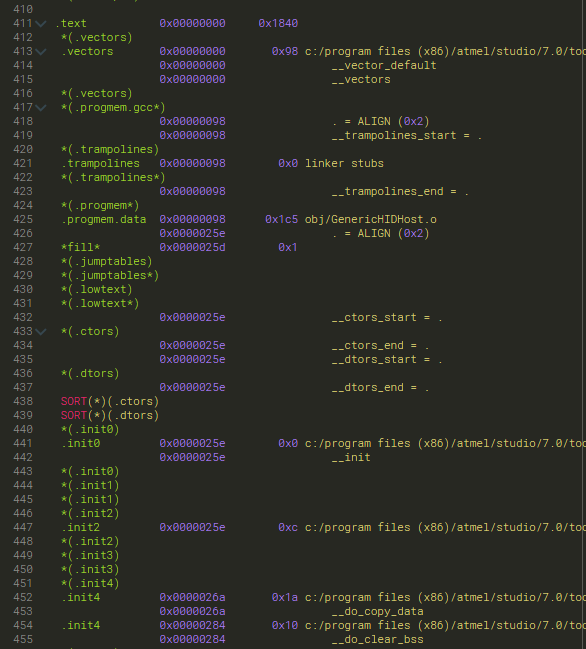
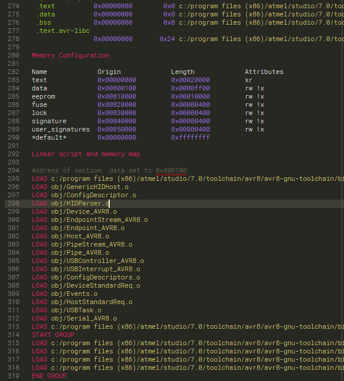

# Sublime Text Syntax - Generic GNU MAP

This is a Sublime Text 3 syntax definition for GNU MAP listing files, produced
by GCC. These files contain symbol map information dumped from a compiled
application binary.

This syntax definition provides some basic highlighting to make these files
easier to read. It is a generic syntax, thus should work regardless of the
architecture being used.

# Samples:

# License

See [license information here](LICENCE.txt).
